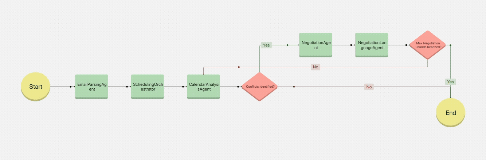

# AI-Scheduling-Assistant

### Introduction

#### Overview:

Welcome to the Agentic AI Scheduling Assistant Hackathon! This challenge invites developers, AI enthusiasts, and innovators to build an intelligent scheduling system that leverages Agentic AI - a next-generation approach where AI acts autonomously to achieve complex goals.

Your mission: Create an AI assistant that eliminates the back-and-forth of meeting coordination by autonomously scheduling, rescheduling, and optimizing calendars.

#### Why Agentic AI?

Traditional scheduling tools rely on rule-based automation or human input. Your solution should go further by:

- Reasoning like a human assistant (e.g., prioritizing attendees, resolving conflicts).
- Acting independently (e.g., sending follow-ups, adjusting for time zones).
- Learning from user preferences (e.g., preferred times, recurring meetings).

#### Key Features to Consider:

##### Your solution should aim to include: <br>

✅ Autonomous Coordination: The AI initiates scheduling without human micromanagement. <br>
✅ Dynamic Adaptability: Handles last-minute changes or conflicting priorities. <br>
✅ Natural Language Interaction: Users may converse with the AI (e.g., “Schedule a meeting on Tuesday”). <br>
✅ Latency: (Time taken from Sending Input JSON & getting Output JSON) should be < 10 sec. <br>

#### Success Metrics:

#### A winning solution will excel in: <br>

✅ Autonomy: Minimal human intervention needed. <br>
✅ Accuracy: Few scheduling errors or conflicts. <br>
✅ User Experience: Intuitive and time-saving. <br>

#### Setup & Requirements:

- Tools/APIs Needed: LLM ( vLLM server running on MI300 GPU).
- Calendar APIs (Google Calendar).
- Framework – May use License free tools & packages
- Development Environment: Python

---

### Prerequisite :

##### Run the below command in your Notebook Terminal to update the scripts.

```
git clone https://github.com/Nancy-30/AMD-MI300-GPU---Brahmastra/blob/main/Submission.ipynb
cp -r AI-Scheduling-Assistant/* ./
```

---

### Setting-Up vLLM Server with Large Language Models :

vLLM is an open-source library designed to deliver high throughput and low latency for large language model (LLM) inference. It optimizes text generation workloads by efficiently batching requests and making full use of GPU resources, empowering developers to manage complex tasks like code generation and large-scale conversational AI.

#### Start the vLLM server with DeepSeek LLM 7B Chat Model

Open a new tab in this Jypyter server, click on the terminal icon to open a new terminal, then copy the following command to launch the vLLM server:

#### Start the vLLM server with Meta-Llama-3.1-8B-Instruct Model

Open a new tab in this Jypyter server, click on the terminal icon to open a new terminal, then copy the following command to launch the vLLM server:

```bash
HIP_VISIBLE_DEVICES=0 vllm serve /home/user/Models/meta-llama/Meta-Llama-3.1-8B-Instruct \
        --gpu-memory-utilization 0.3 \
        --swap-space 16 \
        --disable-log-requests \
        --dtype float16 \
        --max-model-len 2048 \
        --tensor-parallel-size 1 \
        --host 0.0.0.0 \
        --port 4000 \
        --num-scheduler-steps 10 \
        --max-num-seqs 128 \
        --max-num-batched-tokens 2048 \
        --max-model-len 2048 \
        --distributed-executor-backend "mp"
```

#### For setting up vLLM server with LLama Model & usage, please follow : [vLLM_Inference_Servering_LLaMA](https://gitenterprise.xilinx.com/asirra/AI-Scheduling-Assistant/blob/main/vLLM_Inference_Servering_LLaMA.ipynb)

---

# Solution

## Overview

The AI Scheduling Assistant was designed to streamline the process of meeting scheduling and rescheduling by leveraging a modular and agent-driven architecture. Each agent in the system specializes in a specific task, and the overall workflow is orchestrated to ensure seamless coordination, conflict resolution, and communication.

## Agent Functionality

### SchedulingOrchestrator:

- Orchestrates the entire scheduling workflow by coordinating the actions of all agents.
- Tasks performed:
  - Initiates the scheduling process by parsing input data.
  - Retrieves calendar events and invokes the CalendarAnalysisAgent for conflict detection.
  - Manages negotiation rounds using the NegotiationAgent until a conflict-free proposal is identified.
  - Consolidates the final schedule and generates responses using the NegotiationLanguageAgent.
- Example: The orchestrator ensures that all steps are executed in sequence and that the final output includes meeting details, metadata, and communication logs.

### EmailParsingAgent:

- This agent is responsible for parsing the incoming email to extract critical meeting details.
- Tasks performed:
  - Extraction of meeting time, duration, subject, and constraints from the email body.
  - Parsing natural language references like "next Monday morning" or "Thursday at 11:00 AM."
  - Ensures accurate interpretation using flexible date parsing methods.
- Example Usage: When a user sends an email like, "Let's meet on Monday at 9:00 AM," the agent extracts the exact time (2025-07-21T09:00:00), calculates the duration (30 minutes default), and identifies constraints.

### CalendarAnalysisAgent:

- Analyzes participants' calendars to detect scheduling conflicts.
- Tasks performed:
  - Retrieves all calendar events for the specified time range.
  - Detects overlaps between proposed meeting times and existing events.
  - Categorizes conflicts into severity levels (e.g., low, medium, high).
  - Provides recommendations for resolving conflicts.
- Example: If two participants have overlapping events on the proposed day, the agent suggests an alternative time or day.

### NegotiationAgent:

- Handles the resolution of conflicts by proposing alternative meeting times.
- Tasks performed:
  - Applies predefined negotiation strategies (e.g., next_day_same_time, next_available_day, same_day_shift) to find new time slots.
  - Iteratively adjusts the proposal until a conflict-free time is determined or negotiation rounds are exhausted.
- Example: If the initial proposed time conflicts with a workshop, the agent moves the meeting to the next available day at the same time.

### NegotiationLanguageAgent:

- Crafts human-like emails to communicate scheduling changes with participants.
- Tasks performed:
  - Generates polite and professional messages for rescheduling requests or confirmations.
  - Incorporates reasoning and context about the proposed changes.
- Example: If a meeting is rescheduled due to conflicts, the agent generates an email like: "Hi Team, I've noticed scheduling conflicts for the proposed time. Would it be possible to meet on Wednesday at 9 AM instead?"

## Workflow

### Input Parsing:

- The EmailParsingAgent interprets the email content to extract meeting details (e.g., proposed time, duration, subject, and attendees).

### Initial Proposal Creation:

- The SchedulingOrchestrator creates an initial meeting proposal based on parsed details.

### Calendar Retrieval:

All participants' calendar events are retrieved for analysis via integration with Google Calendar APIs.

### Conflict Detection:

- The CalendarAnalysisAgent identifies conflicts by comparing the proposed time against participants' schedules.
- Conflicts are categorized as none, low, medium, or high.

### Conflict Resolution:

- The NegotiationAgent proposes alternative times using strategies like:
- next_day_same_time: Move to the next day while keeping the same time.
- next_available_day: Skip to the next completely free day.
- same_day_shift: Adjust the time on the same day to avoid short conflicts.

### Polite Communication:

- The NegotiationLanguageAgent generates professional emails to communicate proposed changes to participants.

### Iteration:

- If conflicts persist, the process is repeated for up to 5 negotiation rounds or until a conflict-free solution is found.

### Finalization:

- The orchestrator consolidates all data into a structured response, including the final schedule, metadata, and logs of negotiation steps.

### **Workflow in Action**

Below is a quick demo showcasing how the AI Scheduling Assistant automates meeting coordination:


